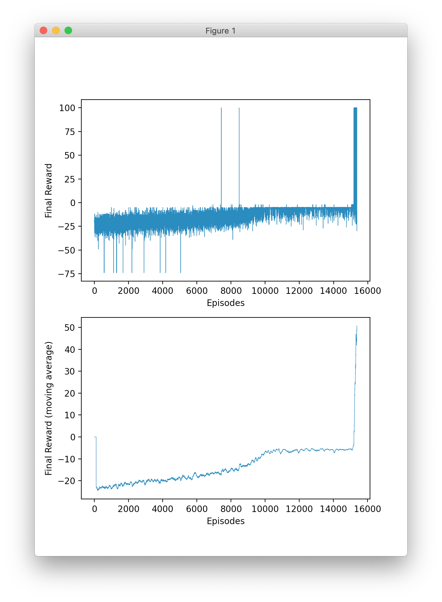

# Description

Solve [Peg solitaire](https://en.wikipedia.org/wiki/Peg_solitaire)
using reinforcement learning. The code is written in Python and uses:

* [PyTorch](https://pytorch.org/)
* [OpenAI Gym](https://gym.openai.com/)
* A custom OpenAI Gym environment: [gym-solitaire](https://github.com/taylorjg/gym-solitaire)

This code isn't great. It doesn't always seem to converge.
And even when it does, it is pretty slow to run and can take up to 16,000 episodes
to start solving the puzzle convincingly.

Nonetheless, this is my first attempt at solving a problem using reinforcement learning so I'm
pretty happy with it and have learnt at lot. But I will continue to experiment in an effort to
find an implementation that is quicker and more stable. 

# How it works  

These are just some rough notes for now.

## Game details

* Number of board positions: 33
* Number of all possible actions: 76
  * But, only a small subset of actions are valid in each state
  * e.g. the initial state has 4 valid actions

## Environment details

* State/observations:
  * Are numpy arrays of 33 `0`s/`1`s
    * `0` for an empty board position
    * `1` for an occupied board position
* Rewards:
  * 0 for all moves except the final move of each episode
  * Final move of each episode:
    * +100 if the puzzle is solved correctly i.e. there is a single remaining piece located at the centre of the board
    * Otherwise, the negative sum of the Manhattan distances (from the centre of the board) of the remaining pieces  

## Agent details

* The neural network approximates the afterstate value function
  * It has 33 inputs and 1 output
  
## Training loop details  

* episodes loop:
  * reset env
  * env steps loop:
    * evaluate valid actions for the current state
      * get the valid actions from the env (not standard Gym behaviour)
      * figure out the next board state for each valid action
      * push all the next board states through the neural network to predict the afterstate values
    * use the policy to choose an action
      * with epsilon prob: random choice
      * with (1 - epsilon) prob: greedy choice i.e. choose the action with the highest afterstate value estimate
    * step the env with the chosen action
    * calculate the target afterstate value for the current state based on the reward from the env
    added to the discounted estimate of the value for the afterstate resulting from taking the action
    * calculate the loss i.e. the difference between the current estimate of the afterstate
    value of the current state and the calculated target value
    * back propagate the loss  

# Training plots



# Setting up

I'm pretty new to Python and Conda etc. but I think the following should do it:

```
conda env create -f environment.yml
conda develop ../gym-solitaire
```

This assumes that you have cloned [gym-solitaire](https://github.com/taylorjg/gym-solitaire) into `../gym-solitaire`. 

# Play

The following command will load a previously trained model and play a single episode of Solitaire:

```
python td_solitaire.py --play
actions: [44, 69, 65, 28, 57, 65, 73, 41, 74, 8, 17, 27, 0, 32, 66, 47, 33, 71, 58, 4, 0, 56, 30, 15, 49, 11, 20, 54, 24, 13, 7]
  ...
  ...
.......
...X...
.......
  ...
  ...
```

# Train

The following command will train a model and, if successful, save the trained model to `td_solitaire.pt`:

```
python td_solitaire.py
```

# Links

* [Peg solitaire](https://en.wikipedia.org/wiki/Peg_solitaire)
* I created a custom [OpenAI Gym](https://gym.openai.com/) environment: 
  * [gym-solitaire](https://github.com/taylorjg/gym-solitaire)
  * [How to create new environments for Gym](https://github.com/openai/gym/blob/master/docs/creating-environments.md)  
* I have done a lot of reading about reinforcement learning but I found the following to be particularly helpful:
  * [_Reinforcement Learning: An Introduction_](http://incompleteideas.net/book/the-book.html) by Richard S. Sutton
and Andrew G. Barto
    * Chapter 6 _Temporal-Difference Learning_
      * Especially Section 6.8 _Games, Afterstates, and Other Special Cases_
    * Section 16.1 _TD-Gammon_
    * [Full Pdf](http://incompleteideas.net/book/RLbook2020.pdf)
  * [Reinforcement Learning in the Game of Othello:
Learning Against a Fixed Opponent
and Learning from Self-Play](https://www.ai.rug.nl/~mwiering/GROUP/ARTICLES/paper-othello.pdf)
